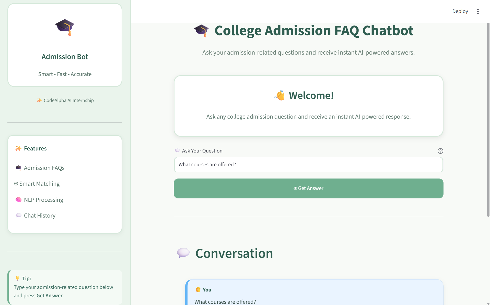

# 🎓 College Admission FAQ Chatbot

An AI-powered College Admission FAQ Chatbot built with **Python, Streamlit, NLP, TF-IDF, and Cosine Similarity**.

The chatbot helps students get quick and relevant answers to common college admission-related questions through a simple and user-friendly interface.

---

## 📸 Project Screenshot



---

## ✨ Features

- 🤖 AI-powered FAQ matching
- 📚 65+ college admission FAQs
- 💬 Interactive conversation history
- 📊 Questions Asked statistics
- 🧠 NLP-based question matching
- 🔍 TF-IDF and Cosine Similarity
- 🎨 Clean and responsive user interface
- 🧹 Clear Conversation option
- ⚡ Instant answers
- 💡 Suggested admission questions
- 🛡️ Fallback response for unknown questions

---

## 🛠️ Technologies Used

- Python
- Streamlit
- Scikit-learn
- NLTK
- TF-IDF Vectorization
- Cosine Similarity

---

## 🧠 How It Works

The chatbot uses Natural Language Processing techniques to find the most relevant answer to a user's question.

### 1. FAQ Dataset

The project contains a collection of college admission-related questions and answers in `faqs.py`.

### 2. TF-IDF Vectorization

The FAQ questions are converted into numerical vectors using **TF-IDF (Term Frequency-Inverse Document Frequency)**.

### 3. Cosine Similarity

The user's question is compared with the stored FAQ questions using **Cosine Similarity**.

### 4. Best Match

The chatbot selects the FAQ with the highest similarity score and displays its corresponding answer.

If no suitable match is found, the chatbot provides a helpful fallback response.

---

## 📂 Project Structure
```text
College-Admission-FAQ-Chatbot/
│
├── app.py
├── faqs.py
├── requirements.txt
├── screenshot.png
└── README.md
```
---

## 🚀 Installation & Setup

### 1. Clone the Repository

bash
git clone https://github.com/Asfa-Mushtaq/College-Admission-FAQ-Chatbot.git

### 2. Navigate to the Project Folder

bash
cd College-Admission-FAQ-Chatbot

### 3. Install Required Libraries

bash
pip install -r requirements.txt

### 4. Run the Application

🎨 User Interface

The application includes:

Clean admission chatbot design
Sidebar navigation
User and bot chat bubbles
Statistics card
Suggested questions
Responsive buttons
Simple and friendly color schemebash
streamlit run app.py

The application will open in your browser.

---

## 💬 Example Questions

You can ask questions such as:

What courses are offered?
How can I apply for admission?
What documents are required?
Is hostel facility available?
What is the admission fee?
Can I pay the fee in installments?
Does the college have a library?
Are sports facilities available?
Is Computer Science available?
Does the college provide transport?

---

👩‍💻 Author

Asfa Mushtaq

BS Computer Science Student
Python & AI Enthusiast

---

⭐ Project

If you find this project useful, consider giving the repository a ⭐ on GitHub.
